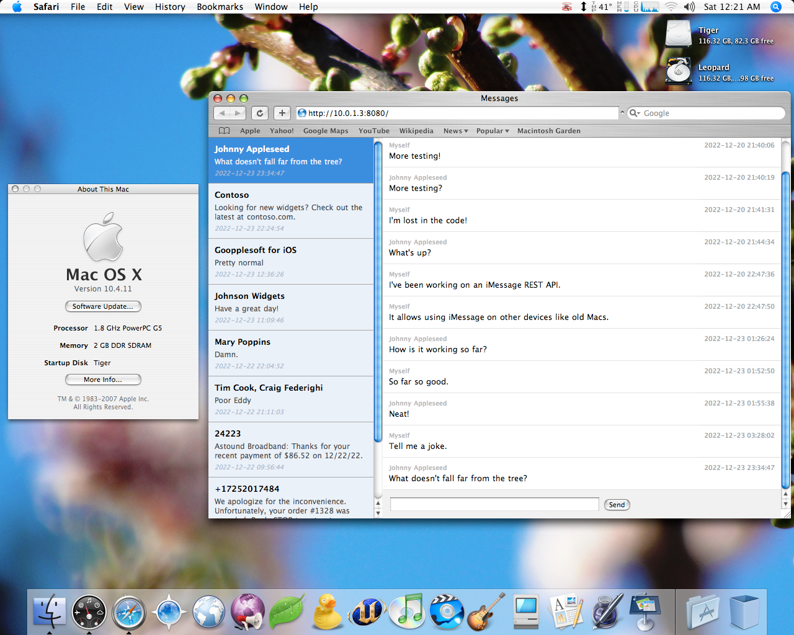

# Message Bridge

A simple solution for accessing iMessage and SMS chats from older computers.

## Requirements

Message Bridge runs on a modern Mac signed into iMessage. Once running, you can access it via a web browser on older computers.

1. Modern Mac to run Message Bridge:
   - macOS 10.15 or later (tested on macOS 10.15.7, 11.7.2, and 13.1)
   - Messages signed into iMessage with at least one existing chat
2. Old machine to access Message Bridge:
   - Connected to the same network as the modern Mac running Message Bridge
   - Running a web browser that supports `XMLHttpRequest`:
     - Safari 1.2 or later (tested 1.3 and 3.0)
     - Camino (tested all versions)
     - Firefox (tested 1.0 and later)
     - Classilla (tested 9.3.4 with NoScript set to allow JavaScript)
     - RetroZilla (tested 2.2)
     - Internet Explorer 5.5 or later (tested all versions)
     - TenFourFox/InterWebPPC
     - Probably others!

## Installation

Perform the following steps on your modern Mac signed into iMessage.

1. Download from the [releases page](https://github.com/dremin/message-bridge/releases).
2. Uncompress the downloaded archive and open the MessageBridge directory.
3. Right-click (or control-click) `MessageBridge`, select Open, then click Open in the alert to start Message Bridge.
4. **Important:** You must grant permissions so that Message Bridge can send messages, access received messages, and access contacts:
   - You may be prompted to allow Terminal to access the folder where Message Bridge resides; click OK if so.
   - You will be prompted to allow Terminal to control Messages. Click OK.
   - Then, you will be prompted to allow Terminal to access contacts. Click OK.
   - Finally, we must manually enable Full Disk Access for Terminal. To do so, perform these steps:
     1. On Ventura (macOS 13) or later, open System Settings > Privacy & Security > Full Disk Access
        - On Monterey (macOS 12) or earlier, open System Preferences > Security & Privacy > Privacy > Full Disk Access, then click the lock at the bottom of the window to enable access to the settings.
     2. Find Terminal in the list, then click the toggle to enable it.
     3. You will be prompted to restart Terminal to provide full access. Click "Later"--we already have the necessary access.
5. All set! On the desired machine, open a web browser to the URL shown in the Message Bridge window (`To access Message Bridge, open a browser to: ___`).

## Security

There is none, so don't configure your router NAT to port forward Message Bridge.

## Tweaks

#### Running Message Bridge on a port other than 8080

Edit the `MessageBridge.command` file in the `MessageBridge` folder, and change the line `MBPORT=8080` to the desired port. Then, run Message Bridge again.

#### Modifying the Message Bridge web client

The `Public` folder within the `MessageBridge` folder contains the web client HTML/CSS/JS, which you may modify to fit your preferences.

## REST API

If you'd like to integrate Message Bridge into your own client, you can use the REST API, which is the same API used by the provided web client.

### Getting chats

GET /messages

**Query parameters:**
- **limit** (default: 5) Controls the number of chats to return.

#### Response

Array of `Chat`:
- **id** Unique chat ID, used to request a chat's messages
- **replyId** Unique chat reply ID, used when sending a message to a chat
- **name** Display name for the chat (group name or recipient name)
- **lastMessage** Latest message received for the chat
- **lastReceived** Date/time the latest message was received
- **service** Service for the chat, `iMessage` or `SMS`

### Getting chat messages

GET /messages/{chatId}

**Query parameters:**
- **limit** (default: 5) Controls the number of chat messages to return.

#### Response

Array of `ChatMessage`:
- **id** Unique message ID
- **chatId** Unique chat ID
- **isMe** Boolean indicating if the message was sent by the local user
- **from** Chat participant who sent the message _(ignore if `isMe` is `true`)_
- **body** Message body text
- **lastReceived** Date/time the message was received

### Sending messages to a chat

POST /messages

**Headers:**
- **Content-Type:** application/json

**Parameters:**
- **address** Chat `replyId` retrieved from `GET /messages` (or address of desired recipient for a new chat)
- **service** Service for the chat, `iMessage` or `SMS`
- **message** Message body text
