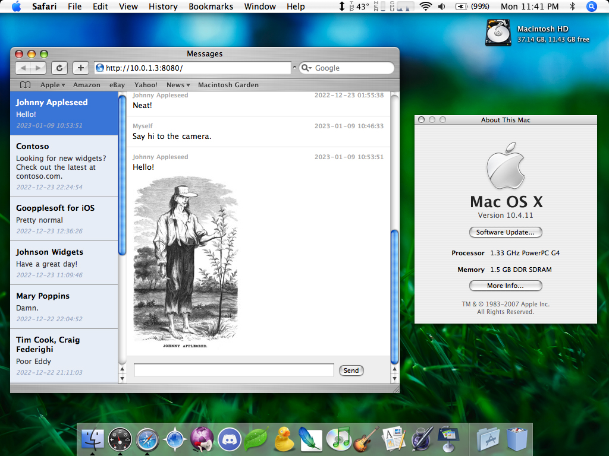

# Message Bridge

A simple solution for accessing iMessage and SMS chats from older computers.

  

## Requirements

Message Bridge runs on a modern Mac signed into iMessage. Once running, you can access it via a web browser on older computers.

1. Modern Mac to run Message Bridge:
   - macOS 10.15 or later (tested on macOS 10.15.7, 11.7.2, 12.6.2, 13.1, 14.2.1, and 15.7)
   - Messages signed into iMessage with at least one existing chat
2. Old machine to access Message Bridge:
   - Connected to the same network as the modern Mac running Message Bridge
   - The JavaScript-enabled client requires a web browser that supports `XMLHttpRequest`:
     - Safari 1.3 or later (tested 1.3 and 3.0)
     - Camino (tested all versions)
     - Firefox (tested 1.0 and later)
     - iCab 3.0.5 or later (tested 3.0.5)
     - Classilla (tested 9.3.4)
       - Configure NoScript to allow JavaScript globally (it doesn't seem to work when only adding to the allow-list)
       - Scrolling doesn't work quite right in Classilla, but is usable
     - RetroZilla (tested 2.2)
     - Internet Explorer 5.5 or later (tested all versions)
       - Internet Explorer 5.0 is supported if [the JScript 5.6 update](https://legacyupdate.net/download-center/search?q=jscript+5.6) is installed
     - TenFourFox/InterWebPPC/Aquafox
     - Probably others!
   - The "lite" client works on browsers without JavaScript support, and browsers that don't support `XMLHttpRequest`.

## Installation

Perform the following steps on your modern Mac signed into iMessage.

1. Download from the [releases page](https://github.com/dremin/message-bridge/releases).
2. Uncompress the downloaded archive and open the MessageBridge directory.
3. Right-click (or control-click) `MessageBridge`, select Open, then click Open in the alert to start Message Bridge.
   - If macOS only gives you an option to move to the trash, you must open System Settings > Privacy & Security, scroll to the bottom, and select the option to open MessageBridge there.
4. **Important:** You must grant permissions so that Message Bridge can send messages, access received messages, and access contacts:
   - You may be prompted to allow Terminal to access the folder where Message Bridge resides; click OK if so.
   - You will be prompted to allow Terminal to control Messages. Click OK.
   - Then, you will be prompted to allow Terminal to access contacts. Click OK.
   - Finally, we must manually enable Full Disk Access for Terminal. To do so, perform these steps:
     1. On Ventura (macOS 13) or later, open System Settings > Privacy & Security > Full Disk Access
        - On Monterey (macOS 12) or earlier, open System Preferences > Security & Privacy > Privacy > Full Disk Access, then click the lock at the bottom of the window to enable access to the settings.
     2. Find Terminal in the list, then click the toggle to enable it.
     3. You will be prompted to restart Terminal to provide full access. Click "Later"--we already have the necessary access.
5. All set! On the desired machine, open a web browser to the URL shown in the Message Bridge window (`To access Message Bridge, open a browser to: ___`).

## Security

There is none, so don't configure your router NAT to port forward Message Bridge.

## Tweaks

#### Running Message Bridge on a port other than 8080

Edit the `MessageBridge.command` file in the `MessageBridge` folder, and change the line `MBPORT=8080` to the desired port. Then, run Message Bridge again.

#### Modifying the standard Message Bridge web client

The `Public` folder within the `MessageBridge` folder contains the standard web client HTML/CSS/JS, which you may modify to fit your preferences.

#### Adjusting the standard client settings for slower machines

If your machine has performance problems rendering the standard Message Bridge web client, there are a few settings at the very top of `Public/app.js` that you may change to improve performance:
- **`chatsLimit`** (default: `20`) Number of chats to load in the left pane
- **`messagesLimit`** (default: `20`) Number of messages to load in the right pane
- **`inlineImages`** (default: `true`) Whether image attachments should be rendered inline or shown as download links
- **`inlineImageMaxSize`** (default: `300`) The maximum dimension of an inline image thumbnail
- **`downloadScaledImages`** (default: `true`) Whether image attachments should be converted to JPEG and scaled down to `downloadImageMaxSize` when downloading
- **`downloadImageMaxSize`** (default: `1500`) The maximum image dimension when clicking an image attachment
- **`refreshInterval`** (default: `3000`) How often (in milliseconds) to check for new messages

#### Using the "lite" Message Bridge client

The "lite" client, available at `http://<IP address>:8080/lite`, does not use JavaScript and can be used instead. In the "lite" client, you can control the number of items loaded by adding `?limit=5` (to show 5 chats/messages, for example) to the end of the URL.

The `Resources/Views` folder within the `MessageBridge` folder contains the markup for these pages.

## REST API

If you'd like to integrate Message Bridge into your own client, you can use the REST API, which is the same API used by the provided web client.

### Getting chats

GET `/chats`

**Query parameters:**
- **`limit`** (default: 5) Controls the number of chats to return.

#### Response

Array of `Chat`:
- **`id`** Unique chat ID, used to request a chat's messages
- **`replyId`** Unique chat reply ID, used when sending a message to a chat
- **`name`** Display name for the chat (group name or recipient name)
- **`lastMessage`** Latest message received for the chat
- **`lastMessageId`** ID of the latest message received for the chat
- **`lastReceived`** Date/time the latest message was received
- **`service`** Service for the chat, `iMessage`, `RCS`, or `SMS`

### Getting chat messages

GET `/chats/{chatId}/messages`

**Query parameters:**
- **`format`** (default: `false`) Determines whether messages include HTML formatting for links.
- **`limit`** (default: `5`) Controls the number of chat messages to return.

#### Response

Array of `ChatMessage`:
- **`id`** Unique message ID
- **`chatId`** Unique chat ID
- **`isMe`** Boolean indicating if the message was sent by the local user
- **`from`** Chat participant who sent the message _(ignore if `isMe` is `true`)_
- **`body`** Message body text
- **`lastReceived`** Date/time the message was received
- **`attachments`** (optional) Array of `Attachment`:
  - **`id`** Unique attachment ID, used to request the file
  - **`filename`** The attachment filename to display
  - **`type`** MIME type of the attachment

### Getting the latest chat message ID

GET `/chats/latest`

This is useful for checking for new messages from a client without needing to parse large responses.

#### Response

Unique message ID. Note that this ID may be different from the most recent `latestMessageId` from `GET /chats` if a message from the past arrived late.

### Getting an attachment

GET `/attachments/{attachmentId}`

#### Response

Responds with the file.

### Getting an attachment thumbnail

GET `/attachments/{attachmentId}/thumb`

**Query parameters:**
- **`download`** (default: `false`) Whether the response should include a `Content-Disposition` header to prompt a download
- **`maxSize`** (default: `300`) The maximum dimension of the thumbnail

#### Response

Responds with the image thumbnail if the attachment is an image.

### Sending a message to a chat

POST `/chats`

**Headers:**
- **`Content-Type`** `application/json`

**Parameters:**
- **`address`** Chat `replyId` retrieved from `GET /chats` (or address of desired recipient for a new chat)
- **`isReply`** Boolean indicating if this message is a reply to an existing chat or a new chat
- **`service`** Service for the chat, `iMessage`, `RCS`, or `SMS`. Only needed if `isReply` is `false`.
- **`message`** Message body text
